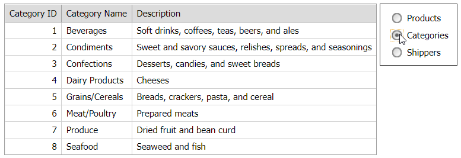

<!-- default badges list -->

<!-- default badges end -->
# Grid View for ASP.NET Web Forms - How to bind the control created in design mode to different data sources at runtime

This example demonstrates how to bind an [ASPxGridView](https://docs.devexpress.com/AspNet/DevExpress.Web.ASPxGridView) with autogenerated columns to different data sources at runtime. The grid is created in design mode.

The project contains an [ASPxRadioButtonList](https://docs.devexpress.com/AspNet/DevExpress.Web.ASPxRadioButtonList) control that allows users to switch between three data sources (SqlDataSource). 

Note that the grid's [`EnableViewState`](https://docs.microsoft.com/en-us/dotnet/api/system.web.ui.control.enableviewstate#System_Web_UI_Control_EnableViewState) property is set to `false` to avoid exceptions when binding the grid to another data source.

## Files to Look At

- [Default.aspx](./CS/Solution/Default.aspx) (VB: [Default.aspx](./VB/Solution/Default.aspx))
- [Default.aspx.cs](./CS/Solution/Default.aspx.cs) (VB: [Default.aspx.vb](./VB/Solution/Default.aspx.vb))

## Documentation

- [Bind Grid View to Data at Runtime](https://docs.devexpress.com/AspNet/403612/components/grid-view/concepts/bind-to-data/bind-to-data-at-runtime)

## More Examples

- [Grid View for ASP.NET Web Forms - How to dynamically switch the Grid's data source and recreate columns at runtime](https://github.com/DevExpress-Examples/aspxgridview-switch-grid-data-source-and-recreate-columns-at-runtime)
- [How to bind ASPxGridView with manually created columns to different data sources](https://github.com/DevExpress-Examples/how-to-bind-aspxgridview-with-manually-created-columns-to-different-data-sources-e2967)
- [How to bind ASPxGridView created at runtime to different data sources](https://github.com/DevExpress-Examples/how-to-bind-aspxgridview-created-at-runtime-to-different-data-sources-e2968)
